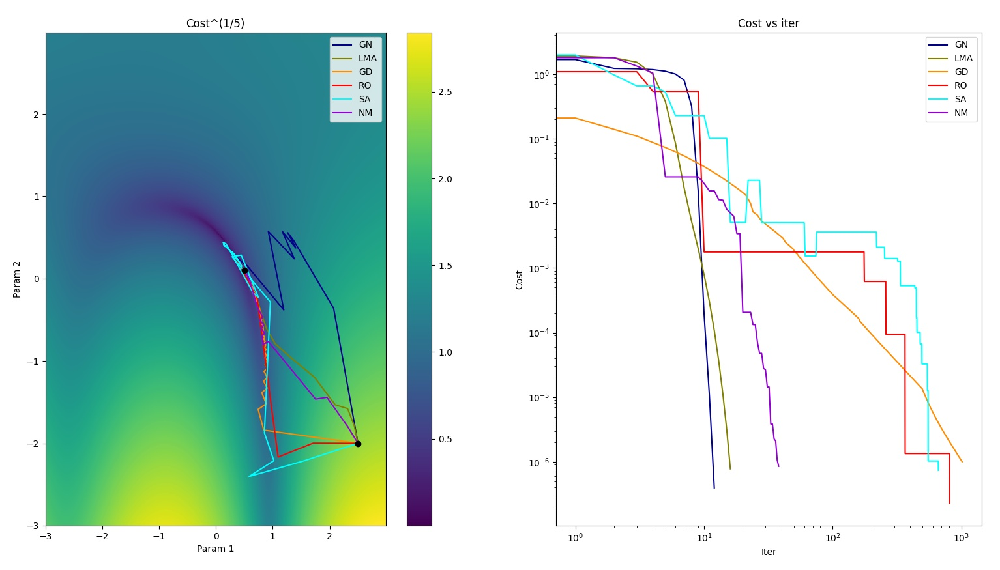

# Optimization toolkit

Home for different numerical optimization algos written in Python from scratch.

## Requirements

- Python 3.6
- Python libraries: numpy

Install requirements by running

```
pip3 install -r requirements-core.txt
```

To run samples, install also additional requirements:

```
pip3 install -r requirements.txt
```

## What does this do?

Given termination criteria and cost function f_cost 

cost = f_cost(errors, parameters),

Solve optimal parameters that will minimize the cost, using selected optimization method.

## Usage

### Minimal direct optimization problem

```
def f_cost(param):
    return (param[0] - 0.5) ** 2 + (param[1] + 0.5) ** 2

optimizer = GradientDescent(f_cost=f_cost)
param, costs, _ = optimizer.run(np.random.randn(2))
```

### Minimal model fitting problem

```
def f_eval(x, param):
    return param[0] * x + param[1]

def f_cost(param, x, y):
    y_estimate = f_eval(x, param)
    errors = y_estimate - y
    return np.mean(errors ** 2)

x = np.arange(1, 100)
param_true = np.array([1.0, 2.5])
y = f_eval(x, param_true)
f_step = lambda k: (0, 1e-3)
optimizer = GradientDescent(f_cost=partial(f_cost, x=x, y=y), f_step=f_step)
param, costs, _ = optimizer.run(np.random.randn(2))
```

### Samples

Samples folder contains multiple samples. Run all samples by typing:

```
./run_samples.sh
```

### Example visualization

Sample: samples/sample_cost_surface_visualization.py:

<p align="center">

</p>