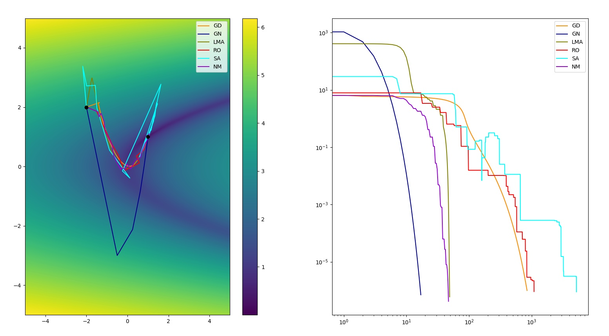

# Optimization toolkit

Home for different numerical optimization algos written in Python from scratch.

## Requirements

- Python 3.6
- Python libraries: numpy

Install requirements by running

```
pip3 install -r requirements-core.txt
```

To run samples, install also additional requirements:

```
pip3 install -r requirements.txt
```

## What does this do?

Given termination criteria and cost function f_cost

cost = f_cost(x),

Find solution x* that will minimize the cost, using selected optimization method.

## Supported optimization methods

Currently, following optimization methods are supported:

**Local optimization, gradient-based**

- Gradient Descent
- Levenberg-Marquardt
- Gauss-Newton
    * Classical GN
    * Damped GN
    * Iterative reweighting

**Local optimization, gradient-free**

- Nelder-Mead
- Random Optimization
- Simulated Annealing

**Global optimization**

- Multi start optimizer; runs specified local optimizer with multiple init guesses

All the methods can be configured flexibly with callbacks.

## Usage

### Minimal minimization problem

```
def f_cost(x):
    return (x[0] - 0.5) ** 2 + (x[1] + 0.5) ** 2

optimizer = GradientDescent(f_cost=f_cost)
output = optimizer.run(np.random.randn(2))
```

### Minimal model fitting problem

```
def f_eval(x, param):
    return param[0] * x + param[1]

def f_cost(param, x, y):
    y_estimate = f_eval(x, param)
    errors = y_estimate - y
    return np.mean(errors ** 2)

x = np.arange(1, 100)
param_true = np.array([1.0, 2.5])
y = f_eval(x, param_true)
optimizer = GradientDescent(f_cost=partial(f_cost, x=x, y=y))
output = optimizer.run(np.random.randn(2))
```

### Samples

Samples folder contains multiple samples. Run all samples by typing:

```
./run_samples.sh
```

## Examples

### Rosenbrock function minimization with various methods

Sample: samples/sample_rosenbrock_minimization.py:

<p align="center">

</p>

### Constrained optimization using penalty method

Sample: samples/sample_penalty_method.py:

<p align="center">

</p>

### Robust curve fitting using iteratively reweighted least squares

Sample: samples/sample_gn_weighted_robust_ls.py:

<p align="center">

</p>